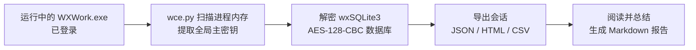

<p align="center">
  
</p>

<h1 align="center">企业微信聊天记录解密导出 · wecom-chat-export</h1>

<p align="center">
  
  
  
  
</p>

<p align="center">
  <b>在本人 Windows 电脑上，解密并导出企业微信（WeCom / WXWork）本地聊天数据库，用于回顾与分析。</b>
</p>

```text
使用 $wecom-chat-export，把最近一个月「前哨科技特训营」的群聊导出来做总结。
```

> 企业微信是**完全独立**于个人微信的体系：它用自研的 **wxSQLite3 AES-128-CBC** 加密，
> 与个人微信的 SQLCipher 4 不是一回事，工具**不可混用**。本仓库仅适用于 **WeCom / WXWork 5.x（Windows 32 位）**。

---

## 目录

- [它能做什么](#它能做什么)
- [环境与兼容性](#环境与兼容性)
- [安装](#安装)
- [配置（一次性）](#配置一次性)
- [使用](#使用)
- [工作原理](#工作原理)
- [导出格式与会话 ID](#导出格式与会话-id)
- [常见问题](#常见问题)
- [数据边界与免责声明](#数据边界与免责声明)
- [许可证与致谢](#许可证与致谢)

---

## 它能做什么

- **无需管理员权限**即可从 `WXWork.exe` 进程内存读取全局主密钥（读的是你自己的进程）。
- 解密 **wxSQLite3 AES-128-CBC** 加密的 `message.db` / `user.db` / `session.db` 等
  企业微信所有库（共用一把 16 字节密钥，无 HMAC、无随机 salt）。
- 把会话导出为 **JSON / HTML / CSV** 三种格式，并列出全部会话，便于进一步分析。
- 全流程脚本**已内置**于本仓库 `scripts/`，无需再从外部手动拉取；`wce.py` 一条命令完成
  「提取密钥 → 解密 → 导出」。

## 环境与兼容性

| 项目 | 范围 |
|---|---|
| 读取系统 | Windows 10 / 11，企业微信桌面客户端已登录且运行中 |
| 实际验证版本 | WXWork 5.0.6.6028（32 位） |
| Python | 在 Python 3.13 验证；代码使用 3.10+ 语法 |
| 依赖 | `pycryptodome`（见 `scripts/requirements.txt`） |
| macOS / Linux | 当前读取器不支持，不能直接照搬 Windows 方案 |

企业微信更新可能导致内存结构变化，需要重新适配。手机上存在的记录不一定已同步到电脑；
数据库检查通过也不能证明同步完整。

## 安装

把本仓库的 `wecom-chat-export/` 文件夹放到 WorkBuddy 的技能目录之一：

- **用户级（所有项目可用）**：`%USERPROFILE%\.workbuddy\skills\wecom-chat-export\`
- **项目级（团队共享）**：`<项目>\ .workbuddy\skills\wecom-chat-export\`

Windows PowerShell 手动安装（含依赖）：

```powershell
$skillDir = Join-Path $HOME '.workbuddy\skills\wecom-chat-export'
git clone https://github.com/woliejia/wecom-chat-export.git $skillDir
Set-Location -LiteralPath $skillDir
python -m venv .venv
.\.venv\Scripts\python.exe -m pip install -r scripts\requirements.txt
```

依赖安装完成后，在 WorkBuddy 中调用 `$wecom-chat-export` 即可。若新技能未显示，重启 WorkBuddy。

## 配置（一次性）

编辑（或新建）`scripts/config.json`，**显式**填好本机数据目录：

```json
{
  "wxwork_db_dir": "C:/Users/你的用户名/Documents/WXWork/账号ID/Data",
  "wxwork_keys_file": "wxwork_keys.json",
  "wxwork_decrypted_dir": "wxwork_decrypted",
  "wxwork_export_dir": "wxwork_export"
}
```

> **重要**：若自动探测失败（例如「文档」目录被迁移到其他盘、或企业微信装在非默认位置），必须手动指定
> `wxwork_db_dir` 到包含 `message.db` 的 `Data` 文件夹。`self_id` 会从该路径最后一段
> 16 位数字自动推断。`config.example.json` 为模板，可直接复制改名使用。

## 使用

**一条命令跑完全流程**（推荐）：

```powershell
.\.venv\Scripts\python.exe scripts\wce.py
```

`wce.py` 会自动：检查 WXWork 是否在运行 → 从内存提取密钥 → 解密数据库 → 导出全部会话。
常用参数：

```powershell
.\.venv\Scripts\python.exe scripts\wce.py --list                 # 仅列出会话
.\.venv\Scripts\python.exe scripts\wce.py --formats json          # 只导出 JSON
.\.venv\Scripts\python.exe scripts\wce.py --conversation R:1970324996143826   # 只导出某个群
.\.venv\Scripts\python.exe scripts\wce.py --skip-extract          # 复用已有密钥
.\.venv\Scripts\python.exe scripts\wce.py --skip-decrypt          # 只重新导出
```

**手动分步**（等价于上面的流程）：

```powershell
.\.venv\Scripts\python.exe scripts\find_wxwork_keys.py     # 提取密钥 -> wxwork_keys.json
.\.venv\Scripts\python.exe scripts\decrypt_wxwork_db.py    # 解密 -> wxwork_decrypted/
.\.venv\Scripts\python.exe scripts\export_wxwork_messages.py --list                  # 列出会话
.\.venv\Scripts\python.exe scripts\export_wxwork_messages.py --formats json,html,csv # 导出全部
```

## 工作原理



- **密钥提取**：以 `OpenProcess(PROCESS_VM_READ | PROCESS_QUERY_INFORMATION)` 打开自己的
  `WXWork.exe`，结构体扫描定位内存中的 cipher 对象（`raw_key` 在 +0x08，32 位指针），
  **无需管理员**。企业微信重启后内存密钥会变化，每次会话重新提取即可。
- **逐页解密**：页面大小 4096，固定 salt `b"sAlT"`；第 n 页
  `key = MD5(raw_key + uint32_LE(n) + b"sAlT")`，IV 由 SQLite3MultipleCiphers 的 LCG + MD5 派生。
  详见 [`references/algorithm.md`](references/algorithm.md)。
- **导出**：`message.db` 存消息、`user.db` 解析成员名、`session.db` 提供会话清单。

## 导出格式与会话 ID

| 格式 | 说明 |
|---|---|
| `messages.json` | 完整结构化数据，便于程序分析 |
| `messages.html` | 仿微信气泡排版的可离线网页，浏览器直接打开 |
| `messages.csv` | 表格，便于 Excel / 透视 |

会话 ID 前缀：`R:` 群聊，`S:` 一对一，`M:` 微信联系人，`Y:` 系统/应用，`MAIL`/`FILEASSIST` 特殊。

## 常见问题

- **`No module named 'Crypto.Util'`**：`pip` 被中断导致 `pycryptodome` 安装不全。删除
  `site-packages/Crypto` 后 `--force-reinstall pycryptodome`。
- **`wxwork_db_dir` 找不到 / 解密为空**：确认路径指向含 `message.db` 的 **扁平 `Data`**
  文件夹，而非上级目录（脚本按相对路径定位 `user.db`/`session.db`）。
- **企业微信没开 / 没登录**：提取与解密都依赖运行中的客户端，先打开并登录。
- **换电脑或重装**：重新 `git clone` + 装依赖即可；密钥每次重新提取，无需保存。

## 数据边界与免责声明

仅供导出**本人已同步**的聊天记录做个人分析。读取与解密在本机完成；后续交由模型分析时，
所提供消息文本会离开本机，因此整条流程并非完全离线。图片、音视频的内部内容默认不识别，
只保留「发送了媒体」的标记。涉及个股 / 投资的群聊内容均为群友个人观点，**不构成任何投资建议**。

`config.json`、`wxwork_keys.json`、解密库与导出结果均**不应提交到 Git**（仓库已用
`.gitignore` 排除）。不要在 Issue 中上传原始数据库、密钥或未脱敏聊天记录；故障反馈请提供
系统版本、企业微信版本与脱敏后的错误信息。

## 许可证与致谢

本仓库包装代码（README、SKILL.md、`wce.py`、`references/`、LICENSE / NOTICE）以
[MIT](LICENSE) 发布。

解密 / 导出引擎（`scripts/` 下 7 个文件）改编自社区项目
[kenchikuliu/wechat-local-backup-search](https://github.com/kenchikuliu/wechat-local-backup-search)
（原 `ylytdeng/wechat-decrypt` 的镜像，后者因 DMCA 下架）。上游许可与署名见 [NOTICE](NOTICE)，
再分发前请自行核实。本仓库为独立社区项目，与腾讯、企业微信及上游作者**无隶属或官方背书关系**。
